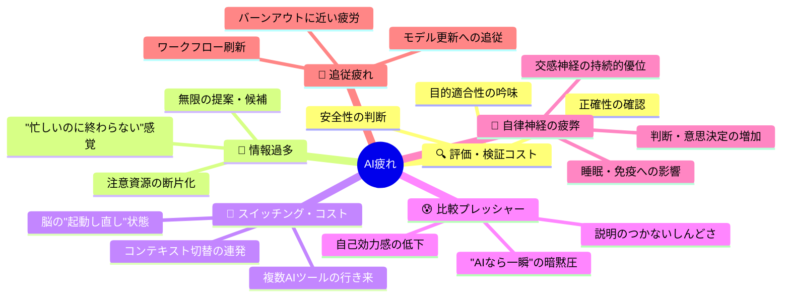
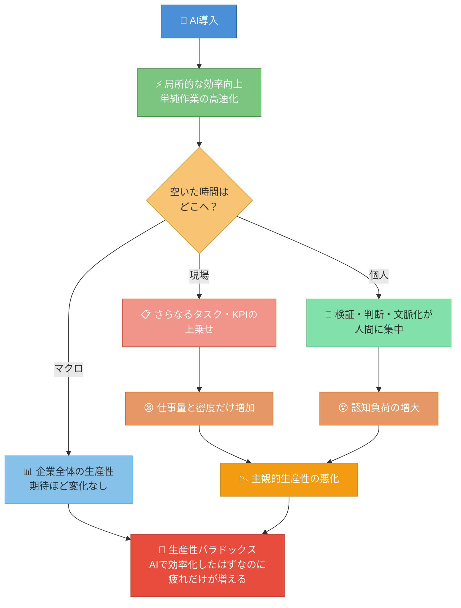
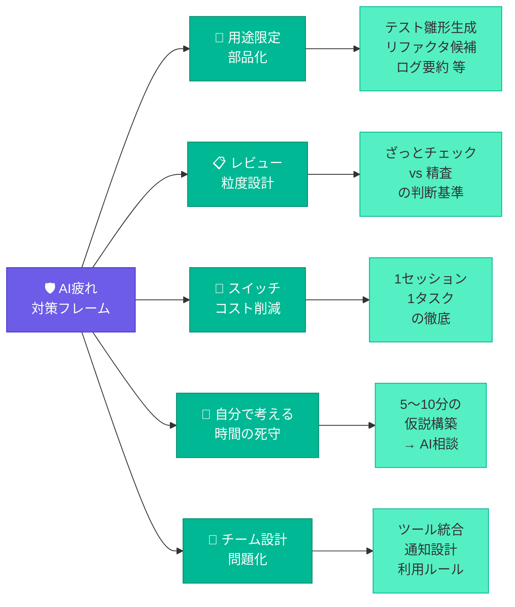

# ai疲れの正体と生産性の行方

「AI疲れ」は、AIで効率は上がっているはずなのに、むしろ脳とメンタルが削られて生産性も主観的には下がって感じられる状態だと整理できます。[^5][^7]

## AI疲れの「正体」

AI疲れの中身は、かなり具体的な要素に分解できます。[^6][^11][^5]

- AI出力の「評価・検証」コスト
文章・コード・要約などを「正しいか・安全か・目的に合っているか」で吟味するメタ認知作業が増え、脳の負荷が大きい。[^4][^5]
- 情報過多と注意資源の断片化
無限に出てくる提案・候補・バージョンを捌くうちに、集中が細切れになり「一日中忙しいのに、何も終わってない」感覚が強まる。[^7][^4][^5]
- ツール／タブのスイッチング・コスト
複数AIやSaaSを行き来することで、コンテキスト・スイッチが連発し、脳が常時「起動し直し」状態になる。[^7]
- 「AIと比較される」プレッシャー
「AIなら一瞬」「AIは24時間働く」という暗黙の圧が、自己効力感を削り、説明のつかないしんどさにつながる。[^9][^13]
- 常時「考え続ける」ことによる自律神経の疲弊
ルーチンは軽くなっても、判断・意思決定は増え、交感神経優位が続いて睡眠・免疫・メンタルに影響が出る。[^8][^6]
- 変化スピードへの追従疲れ
モデル更新やワークフロー刷新にキャッチアップし続けること自体が、特にハイスキル層の負担になり、バーンアウトに近い疲労感を生む。[^10]

エンジニア文脈だと、「AI reviewer を相手にし続けている」「プロンプト設計と検証だけで1日終わる」「何でもまずAIに通す運用」が、じわじわ効いてきます。[^5][^10]

### 📊 AI疲れの構造マップ

## 生産性はどこへ行くのか

マクロでもミクロでも、「AI入れたのに生産性の実感は薄い／むしろ疲れた」という「生産性パラドックス」が観測されています。[^12][^13][^4]

- マクロ：雇用・生産性の統計へのインパクトはまだ限定的
経営層の期待ほど、企業全体の生産性や利益に大きな変化は出ていないという調査も多い。[^12]
- 現場：効率アップ分が「仕事の上乗せ」に吸収される
自動化して空いた時間に、さらにタスクやKPIが詰め込まれ、結果として仕事量と密度だけが上がる「生産性向上の罠」が起きやすい。[^13][^4]
- 個人：ローレイヤ作業は速くなるが、認知負荷はむしろ増える
AIが単純作業を削る一方で、検証・判断・文脈化・責任だけ人間に集中し、精神的疲労を増やしてしまう。[^4][^5]

端的に言うと、「局所的な効率向上 → 認知コスト増\&タスク増加 → 主観的生産性は悪化」という構図になりがちです。[^13][^4]

### 📊 生産性パラドックスの構造

## じゃあ、どうすれば「ちゃんと楽になるか」

ソフトウェアエンジニア目線で、「AI疲れを回避しつつ生産性を上げる」ための実践的な方向性だけざっとまとめます。[^4][^5][^7]

- AIを「常時フロント」ではなく「明確な用途の部品」にする
何でもまずAIではなく、用途を限定（例：テスト雛形生成、既存コードのリファクタ候補、ログ要約専用など）して、判断対象を絞る。
- レビュー粒度を決めておく
「この種のアウトプットはざっとチェック」「この種は一行ずつ精査」など、自分なりの検証ポリシーを決めて、メタ認知の負荷を平準化する。
- コンテキスト・スイッチを減らす設計
1セッション1タスク（例：AIとの対話中はVS Codeの別タブを極力開かない）を守るだけでも、疲労感はかなり変わる。[^5][^7]
- 「AIに投げる前に5〜10分だけ自分で考える」時間を死守
いきなりAIに聞かず、自分の仮説を書いてから相談すると、AI出力の評価が速くなり、依存感・無力感も減る。[^8]
- チーム側の設計問題として扱う
個人努力ではなく、ツール統合・通知設計・AI利用ルール（ログ保存場所、責任の所在など）を決めて、スイッチング・コストと判断回数そのものを減らす。[^7][^13][^4]

例えるなら、「AIに仕事を奪われるか」ではなく、「AIから押し寄せる仕事をどうこちらのペースに組み替えるか」の問題です。[^4][^7]

### 📊 AI疲れ対策の5つの柱

もしよければ、次は「あなたの1日のAIの使い方」を具体的に教えてもらえれば、そのパターンに合わせてワークフロー単位での調整案を一緒に設計します。
[^1][^14][^15][^2][^3]

⁂

[^1]: https://techplay.jp/event/986767

[^2]: https://findy-code.io/events/TKG9kmGx2oGED

[^3]: https://x.com/hiroki_daichi/status/1979685178303013135

[^4]: https://note.com/ai_data/n/n7750dbf82366

[^5]: https://zenn.dev/karamage/articles/306f0c571e0af9

[^6]: https://shuchi.php.co.jp/article/12671

[^7]: https://asana.com/ja/resources/tool-fatigue

[^8]: https://forbesjapan.com/articles/detail/89921

[^9]: https://syu-m-5151.hatenablog.com/entry/2025/07/16/115510

[^10]: https://note.com/yuichiro826/n/n285026b11564

[^11]: https://biz.hrbase.jp/article/ai-technostress/

[^12]: https://gigazine.net/news/20260219-ai-productivity-paradox/

[^13]: https://www.dlri.co.jp/report/ld/512572.html

[^14]: https://smart-sou.co.jp/news/20250612

[^15]: https://www.kokuyo-furniture.co.jp/solution/mana-biz/2021/08/ai10.php

